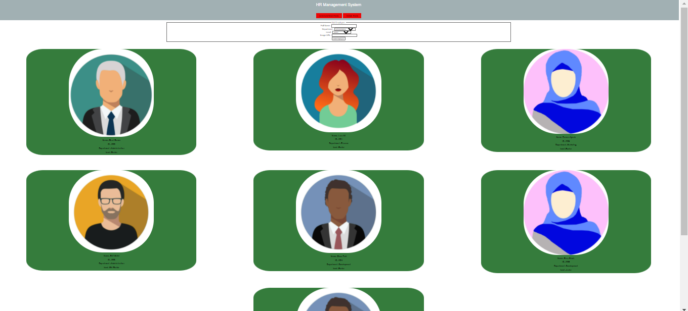

# HR-management-system

we make style and add some functionality to the project  

Today Change 

* we added table contain all the informaion to the employee and calculate the average
* save the data in local storage 
* update the css file 
